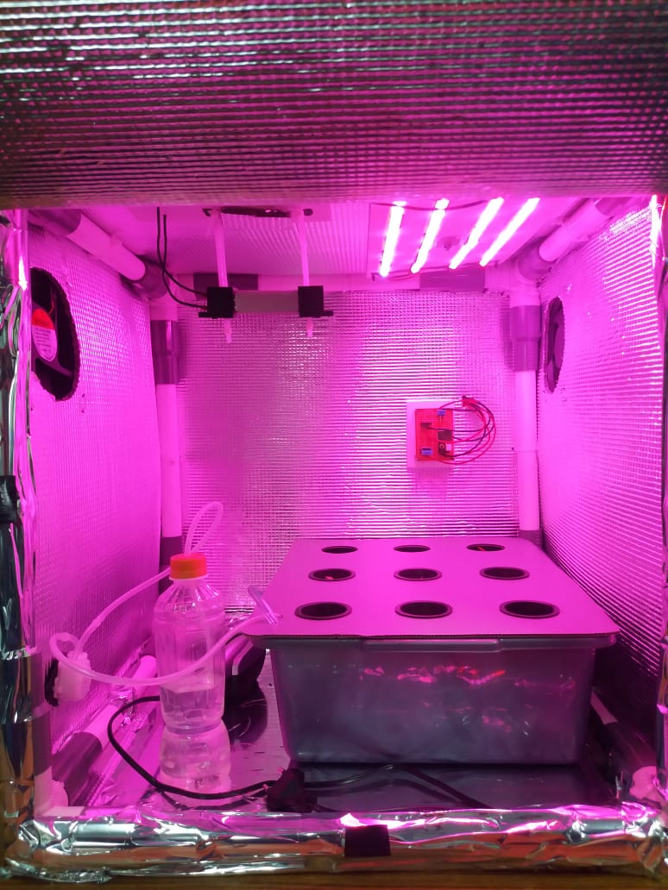
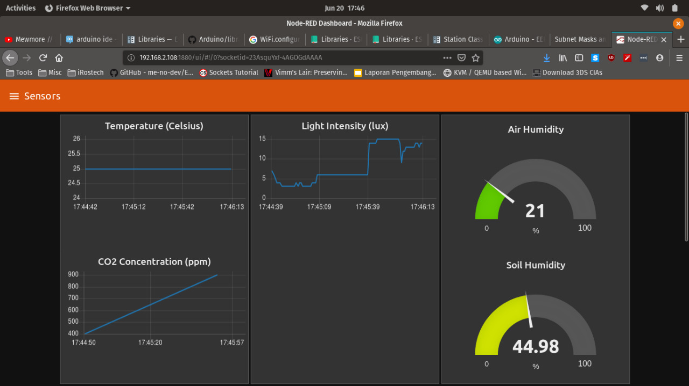

# PFC
PFC (Personal Food Computer) is an IoT based mini plant growing chamber. It consists of sensors (temperature, humidity, light intensity) and actuators (fans, heater, LED lights) mounted on a 50cmx50cmx50cm chamber.

 
<h2>Chamber</h2>

 
<h2>Dashboard</h2>

